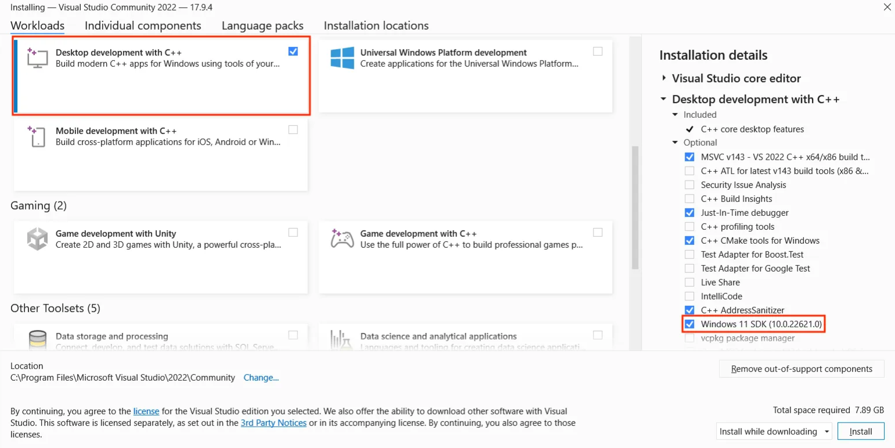

# CONFIGURACIÓN

[← Regresar a notas](../../README.md) <br>

----
📌 GraalVM está basada en una LTS del JDK, pero tiene una numeración diferente para sus versiones.

### ⚙️ Instalar GraalVM (Windows)


> ⬇️ [Descargar GraalVM](https://github.com/graalvm/graalvm-ce-builds/releases?page=2) para `Windows (amd64)` y guardar los binarios en la ruta sugerida `C:\dev-environment\java\graalvm-community-openjdk-17.0.8`.

> 💻 Establecer las siguientes variables de entorno:
> 
> - `JAVA_HOME`: `D:\dev-environment\java\graalvm-community-jdk-17.0.8`
> - `GRAALVM_HOME`: `D:\dev-environment\java\graalvm-community-jdk-17.0.8`
>
> Añadir la referencia `%JAVA_HOME%\bin` y `%GRAALVM_HOME%\bin` en el `Path`.

> ⬇️ Abrir `cmd` como administrador e instalar `native-image` a través de `gu` *(gestor de paquetes ubicado en los binarios de graalvm).*
> ```shell
>   gu install native-image
> ```

> ⬇️ [Descargar Visual Studio](https://visualstudio.microsoft.com/es/downloads/)
> 
> Seleccionar la opción "Desktop developmetn with C++", ya que contiene el `Windows SDK`.
>
> 

---
📌 Referencias:

- [YouTube - Instalar GraalVM](https://youtu.be/g9BqJ4ystBM?si=lg9F1n3qSAQiI9sp)
- [YouTube - Instalar Visual Studio Build Tools](https://youtu.be/XH0TCMt1rcI?si=0pFxsIHPKfNgbMgI)
- [Publicación - Instalar GraalVM en Windows](https://medium.com/graalvm/using-graalvm-and-native-image-on-windows-10-9954dc071311)